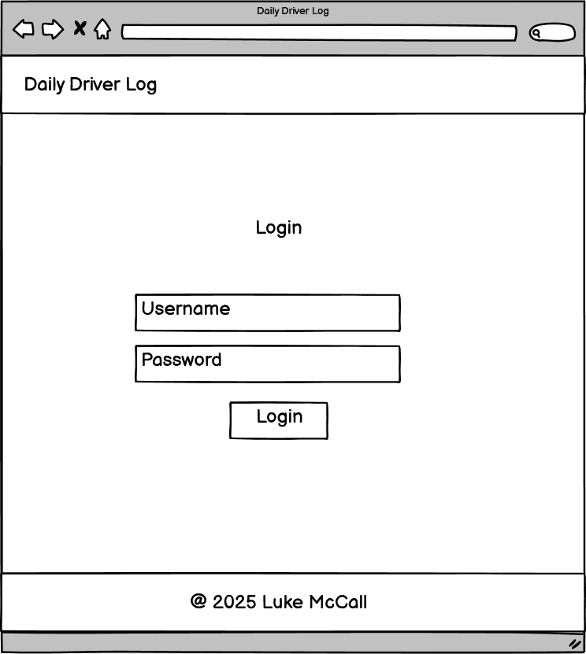
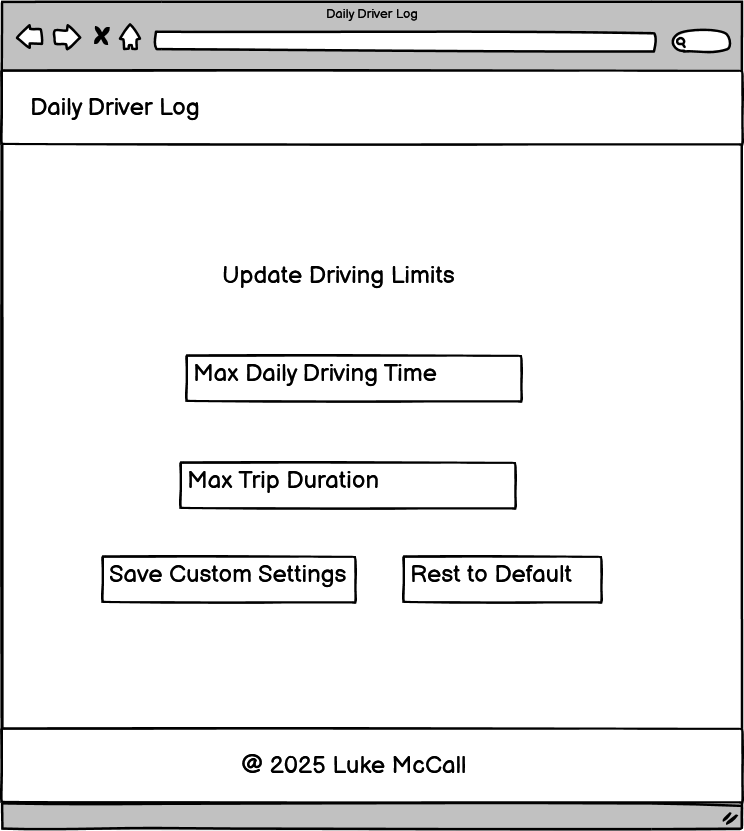

---

# *Daily Driver Log*


The site can be accessed by this [link](https://daily-driver-log-0742a8bbde1f.herokuapp.com/)

## Contents

* [Project Overview](#project-overview)
* [User Stories](#user-stories)
* [Features](#features)
* [Design](#design)
* [Technologies Used](#technologies-used)
* [Deployment](#deployment)
* [Testing](#testing)
* [Credits](#credits)
---

## Project Overview

Daily Driver Log helps professional or frequent drivers manage their driving hours by:
-   Logging individual trips with start/finish times
-	Automatically calculating trip durations
-	Summing up total daily driving time
-	Alerting when trip or daily limits are exceeded


## User Stories

### Must Have
-	As a first-time user, I want to register and log in so I can access my logs.
-	As a returning user, I want to log trips with start and finish times.
-	As a user, I want to view today’s trips and see total drive time.
-	As a user, I want to edit or delete trips in case I make a mistake.
-	As a user, I want to know if I’ve exceeded my daily or trip time limits.
-	As a user, I want my data to be private and secure (only visible to me).
-	As an admin, I want to view/edit/delete any records from the admin panel.

### Should Have
-	Ability to edit Day Logs.
-	Warning banner or visual cues when over driving limits.
-	Input validation. e.g. Cannot input a trip end time thats before a trip start time unless an overnight trip.

### Could Have (Future Development)
-	Customizable driving time limits per user. (Now Implemented)
-	Weekly/monthly driving summaries.
-	CSV export of logs.
-	Graphical reports or charts.

## Features

| Feature                | Description                                                                 |
|------------------------|-----------------------------------------------------------------------------|
| User Authentication    | Register, log in, and log out to access private driving logs.              |
| Create/Delete Day Logs | Manage logs for each driving day.                                 |
| Create/Edit/Delete Trips    | Add, update, or delete individual trips within a day log.            |
| Time Calculations      | Trip and daily durations are automatically calculated.                     |
| Limit Warnings         | Alerts when trip > 5.5 hours or day > 10 hours.                            |
| Mobile Responsive Design | Works across all devices and screen sizes.                            |
| Secure User Access     | Each user sees only their own logs.                                        |
| Admin Panel Access     | Admins can manage all data through Django admin interface.                 |


## Design

### Workflow Diagram

<details>
<summary>Click here to view the workflow diagram.</summary>


</details>

### Entity Relationship Diagram

<details>
<summary>Click here to view the entity relationship diagram.</summary>


</details>

### Wireframes

Click each section to expand and view the wireframe for that page.

<details>
<summary>Home Page Wireframe</summary>


</details>

<details>
<summary>Register Page Wireframe</summary>


</details>

<details>
<summary>Login Page Wireframe</summary>


</details>

<details>
<summary>New Trip Page Wireframe</summary>


</details>

<details>
<summary>Day Summary Page Wireframe</summary>


</details>

<details>
<summary>Dashboard Page Wireframe</summary>


</details>

<details>
<summary>Settings Page Wireframe</summary>


</details>

### Colour Scheme

The application uses a modern, high-contrast colour palette that balances clarity with professionalism::

- **Navigation Bar & Footer:** A matching horizontal blue gradient (`#4facfe` to `#00f2fe`) creates a cohesive header/footer design. This vibrant gradient adds personality while maintaining professionalism.

- **Main Background:** A soft light blue-grey (`#f2f6ff`) is used as the page background, reducing eye strain and allowing content to stand out clearly against it.

- **Headings:** Dark blue (`#2a2a72`) is applied to main headings and section titles, providing strong contrast and a trustworthy tone.

- **Buttons:** Primary buttons use a purple-to-indigo gradient (`#667eea` to `#764ba2`) with rounded edges and hover scaling to draw attention and enhance interactivity.

- **Form Inputs:** Inputs have subtle light borders (`#d1d9e6`) and a soft blue focus glow, maintaining visual clarity and providing feedback without overwhelming the user.

### Typography

- **Main headers** are bold and sized for impact, ensuring clarity and quick recognition of page context (e.g., *Dashboard*, *Day Summary*).

- **Body text** is kept simple and uses Bootstrap’s default fonts for clean readability across devices.

- **Buttons** feature clear, legible text with consistent sizing and contrast, making them easy to identify and interact with — especially important for mobile users.

- **Form labels and modal headings** are centered and structured to help users focus on input fields during data entry, improving efficiency and reducing error.

**Card typography uses a clear hierarchy:**

- **Bold section titles** like *"Total Time Driven"* guide the user to critical information.

- **Subtext**, such as time breakdowns, uses smaller, clean fonts for easy scanning.

- **Coloured text cues** (green for within limit, red for over limit) visually reinforce the data and help users interpret their status at a glance.


## Technologies Used

- Technologies used to create the site include:

    * [HTML](https://developer.mozilla.org/en-US/docs/Web/HTML) - Used to create the templates.
    * [CSS](https://developer.mozilla.org/en-US/docs/Web/css) - Used for styling of the templates.
    * [Python](https://www.python.org/) – The programming language used to build the backend logic with Django.
    * [Django](https://www.djangoproject.com/) - Backend framework used for database models, views, templates, authentication, and admin control.
    * [VS Code](https://code.visualstudio.com/) - Integrated Development Environment used for coding
    * [PostgreSQL](https://www.postgresql.org/) – The production database used via Code Institute’s hosted service.
    * [SQLite](https://www.sqlite.org/) – Used as the local development and testing database.
    * [Git](https://www.git-scm.com/) - was used for website version control.
    * [GitHub](https://github.com/) - was used for hosting of the repository.
    * [Heroku](https://www.heroku.com/) – Platform used to deploy the live app.
    * [Markdown](https://en.wikipedia.org/wiki/Markdown) readme formatting
    * [Google Chrome](https://www.google.co.uk/chrome/) Used for testing layout, validation, and responsiveness.
    * [Bootstrap](https://getbootstrap.com/) – Used for responsive design, layout, and pre-built UI components.
    * [draw.io](https://draw.io/) – Used to create the ERD.


## Deployment

- The Daily Driver Log app is deployed to [Heroku](https://heroku.com/).
- The app can be reached by clicking this [link](https://daily-driver-log-0742a8bbde1f.herokuapp.com/).
- [Github](https://github.com/) was used for version control and repository.

### Local deployment

To run this project locally:

*Note:*
  - This project requires to install all the requirements:
  - Open the terminal window and type:
  - `pip3 install -r requirements.txt`

Create a local copy of the GitHub repository by following one of the two processes below:

- Download ZIP file:
  1. Go to the [GitHub Repo page](https://github.com/TheRealMcCall/daily_driver_log).
  1. Click the Code button and download the ZIP file containing the project.
  1. Extract the ZIP file to a location on your PC.

- Clone the repository:
  1. Open a folder on your computer with the terminal.
  1. Run the following command
`git clone https://github.com/TheRealMcCall/daily_driver_log.git`
--
- Install dependencies:
 `pip3 install -r requirements.txt`

Create a .env file in the root directory and add:

(Set debug to false for production)

```
SECRET_KEY=your_secret_key
DEBUG=True
DATABASE_URL=your_postgres_url (Code instititute PostgreSQL database provided for this project)
```
Apply migrations and create a superuser
```
python manage.py makemigrations
python manage.py migrate
python manage.py createsuperuser
```
Run the server
```
python manage.py runserver
```
Visit http://127.0.0.1:8000/ in a browser to view the app.

### Heroku Deployment (Using Code Institute PostgreSQL)

This project was deployed using Heroku and Code Institute’s free PostgreSQL database.

### Prepare for deployment


  - Add all dependencies to ```requirements.txt```:
      ```
      pip3 freeze > requirements.txt
      ```

  - Add the following to ```settings.py```:
      ```
      import dj_database_url
      
      DATABASES = {
          'default': dj_database_url.parse(os.environ.get('DATABASE_URL'))
      }
      ```
  - Set DEBUG = False for production and add your heroku app URL to ``ALLOWED_HOSTS``:
      ```
      ALLOWED_HOSTS = [.herokuapp.com]
      ```

### Create Heroku app
    
- Go to https://dashboard.heroku.com/
- Click "New > Create New App"
- Choose a unique app name and region.

### Connect Github

- In the Heroku app dashboard, go to Deploy > Deployment Method > GitHub
- Connect your GitHub repository.

### Set config vars
- In Settings > Reveal Config Vars, set:
      ```
      SECRET_KEY = your_django_secret_key
      DATABASE_URL = (provided by Code Institute)
      ```
### Buildpacks
- Under settings, confirm the following buildpack is present:
      ```
      heroku/python
      ```

### Deploy

-  Either enable Automatic Deploys or click Deploy Branch manually.

## Testing

Testing was conducted across all core features. Tests included:

- Browser compatibility
- Form validation (client and server-side)
- User story testing
- Accessibility checks (ARIA, heading structure, Lighthouse)
- Responsive design testing
- JavaScript trip overlap prevention

Full details can be found in [TESTING.md](/TESTING.md).

## Future Features

- User dashboard with weekly/monthly stats.
- Overnight trips show in both day summaries that they are relevant to.
- Alert message when a trip has gone over trip limit.

## Credits

### Media

- The responsive mockup preview was created using [Am I Responsive?](https://ui.dev/amiresponsive).
- Wireframes were created using [Balsamiq Wireframes](https://balsamiq.com/).
- The Entity Relationship Diagram (ERD) was created using [Lucidchart](https://www.lucidchart.com/).
- The Workflow Diagram was created using [draw.io](https://draw.io/).
- The favicon was generated with the help of [ChatGPT by OpenAI](https://openai.com/chatgpt)

### JSON Handling

- [Python json module](https://docs.python.org/3/library/json.html) — for serializing and deserializing Python objects using `json.dumps()` and `json.loads()`.
- [GeeksforGeeks](https://www.geeksforgeeks.org/json-dumps-in-python/) — explained how to convert Python dicts/lists into JSON strings.
- [Stack Overflow](https://stackoverflow.com/questions/2068803/how-to-serialize-queryset-in-django) — showed how to serialize `QuerySet.values()` using `list()` and `json.dumps()` with `DjangoJSONEncoder`.
- [Django Documentation](https://docs.djangoproject.com/en/stable/topics/serialization/#djangojsonencoder) — used to correctly serialize datetime and Decimal types for JavaScript compatibility.


### Acknowledgements

- [Code Institute](https://codeinstitute.net/) — for the educational content and support throughout the course.
- [Iuliia Konovalova](https://github.com/IuliiaKonovalova) — my mentor, for her kind support, constructive feedback, and continuous guidance.
- [Lewis Dillon](https://github.com/LewisMDillon) — Code Institute Cohort Facilitator, for his motivational support and for always being willing to answer my questions when needed.

* [Back To Top](#contents)
