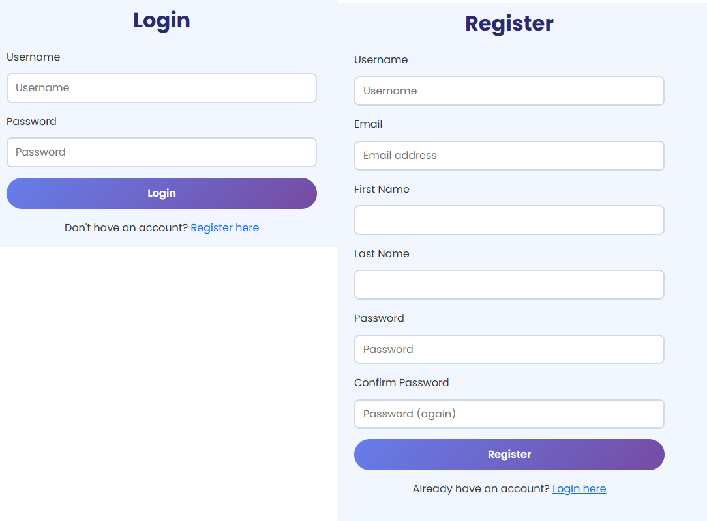
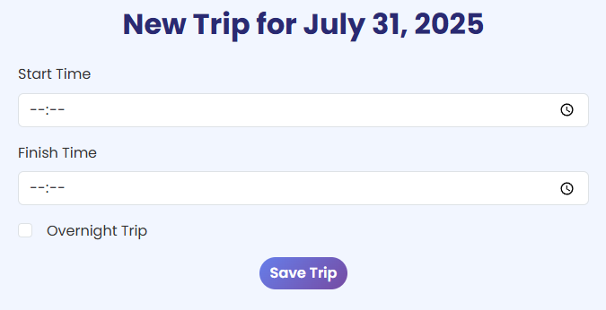
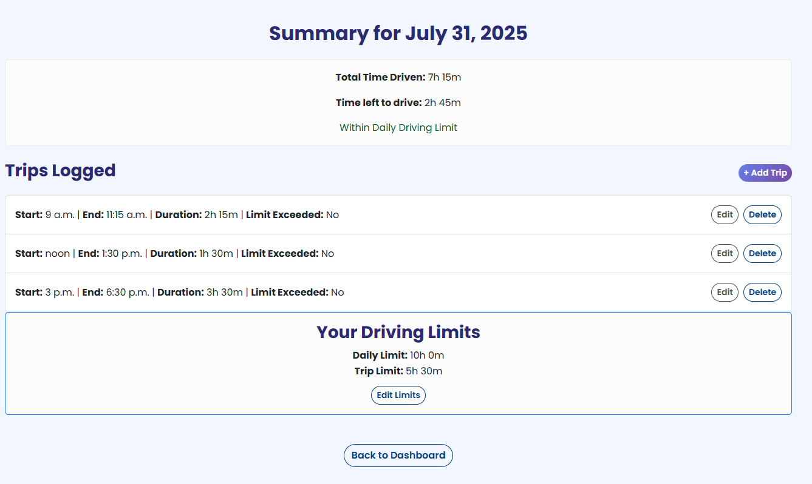
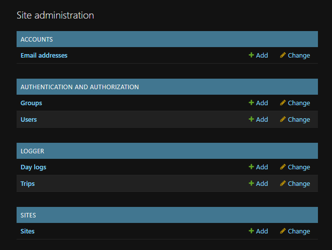
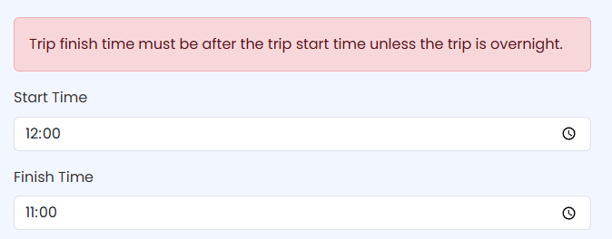
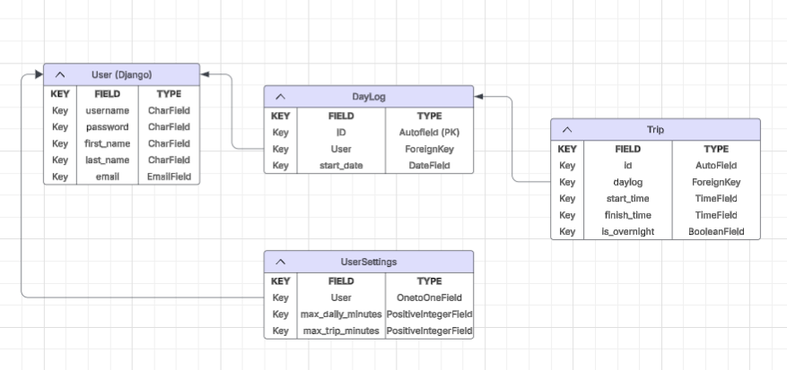

---

# *Daily Driver Log*


The site can be accessed by this [link](https://daily-driver-log-0742a8bbde1f.herokuapp.com/)

## Contents

* [Project Overview](#project-overview)
* [User Stories](#user-stories)
* [Features](#features)
* [Planning and Design](#planning-and-design)
* [Agile Methodology](#agile-methodology)
* [Technologies Used](#technologies-used)
* [Deployment](#deployment)
* [Testing](#testing)
* [Future Features and Improvements](#future-features-and-improvements)
* [Credits](#credits)
---

## Project Overview

**Daily Driver Log** is a web application designed to help professional drivers, such as couriers, PCV operators, and frequent commuters, stay compliant with driving hour regulations and manage fatigue more effectively.

The app allows users to:

- Log individual trips with start and finish times  
- Automatically calculate the duration of each trip  
- Summarise total driving time per day  
- Get instant feedback after logging a trip if limits have been breached.

Users can also define their own custom limits for daily and per-trip driving durations in the **Settings** page, allowing flexibility for different job roles or personal preferences.

The app provides clear warnings if a single trip exceeds the maximum trip time, or if total driving time for the day surpasses the user's limit. A dashboard view displays a running summary of the current day's driving activity, helping users plan their day responsibly.


**Daily Driver Log** was built using Django and follows best practices in user validation, accessibility, responsive design, and error handling. The project also includes thorough testing, user stories, and a structured deployment process.

## User Stories

Below are the user stories organised by priority. Each story expands on click and includes a screenshot where applicable.

### Must Have

<details>
<summary>As a first-time user, I want to register and log in so I can access my logs.</summary>



</details>

<details>
<summary>As a returning user, I want to log trips with start and finish times.</summary>



</details>

<details>
<summary>As a user, I want to view today’s trips and see total drive time.</summary>



</details>

<details>
<summary>As a user, I want to edit or delete trips in case I make a mistake.</summary>


</details>

<details>
<summary>As a user, I want to know if I’ve exceeded my daily or trip time limits.</summary>


</details>

<details>
<summary>As a user, I want my data to be private and secure (only visible to me).</summary>

Not visually demonstrable — covered by authentication logic.

</details>

<details>
<summary>As an admin, I want to view/edit/delete any records from the admin panel.</summary>



</details>

---

### Should Have

<details>
<summary>Ability to view and delete previous Day Logs.</summary>


</details>

<details>
<summary>Warning visual cues when over driving limits.</summary>


</details>

<details>
<summary>Input validation (e.g. can’t input finish time before start unless overnight).</summary>



</details>

---

### Could Have (Future Development)

<details>
<summary>Customizable driving time limits per user. (Implemented)</summary>


</details>

<details>
<summary>Weekly/monthly driving summaries.</summary>

- Planned for a future release.

</details>

<details>
<summary>CSV export of logs.</summary>

- Planned for a future release.

</details>

<details>
<summary>Graphical reports or charts.</summary>

- Planned for a future release.

</details>

## Features

| Feature                    | Description                                                                 | Screenshot |
|----------------------------|-----------------------------------------------------------------------------|------------|
| User Registration          | Users can create an account to access their own logs.                       |  |
| User Login                 | Users log in to access private data.                                        |  |
| User Logout                | Users can securely log out from any page.                                   |  |
| Create/Delete Day Logs     | Manage logs for each driving day.                                           |  |
| Create/Edit/Delete Trips   | Add, update, or delete individual trips within a day log.                   |  |
| Time Calculations          | Trip and daily durations are automatically calculated.                      |  |
| Limit Warnings             | Alerts when trip > 5.5 hours or day > 10 hours.                             |  |
| UX Error Feedback          | JavaScript validation prevents invalid entries and shows helpful messages. |  |
| Mobile Responsive Design   | Works across all devices and screen sizes.                                  |  |
| Secure User Access         | Each user sees only their own logs.                                         | — |
| Admin Panel Access         | Admins can manage all data through Django admin interface.                  | — |


## Planning and Design

### Initial Workflow Diagram
This diagram was created at the start of the project to outline planned structure.

<details>
<summary>Click here to view the initial workflow diagram.</summary>


</details>

### Updated Workflow Diagram
This is the updated workflow diagram.

<details>
<summary>Click here to view the updated workflow diagram.</summary>


</details>

### Entity Relationship Diagram

<details>
<summary>Click here to view the entity relationship diagram.</summary>


</details>

### Wireframes

Click each section to expand and view the wireframe for that page.

<details>
<summary>Home Page Wireframe</summary>


</details>

<details>
<summary>Register Page Wireframe</summary>


</details>

<details>
<summary>Login Page Wireframe</summary>


</details>

<details>
<summary>New Trip Page Wireframe</summary>


</details>

<details>
<summary>Day Summary Page Wireframe</summary>


</details>

<details>
<summary>Dashboard Page Wireframe</summary>


</details>

<details>
<summary>Settings Page Wireframe</summary>


</details>

### Colour Scheme


The application uses a modern, high-contrast colour palette that balances clarity with professionalism:

- **Navigation Bar & Footer:** A matching horizontal blue gradient (`#4facfe` to `#00f2fe`) creates a cohesive header/footer design. This vibrant gradient adds personality while maintaining professionalism.

- **Main Background:** A soft light blue-grey (`#f2f6ff`) is used as the page background, reducing eye strain and allowing content to stand out clearly against it.

- **Headings:** Dark blue (`#2a2a72`) is applied to main headings and section titles, providing strong contrast and a trustworthy tone.

- **Buttons:** Primary buttons use a purple-to-indigo gradient (`#667eea` to `#764ba2`) with rounded edges and hover scaling to draw attention and enhance interactivity.

- **Form Inputs:** Inputs have subtle light borders (`#d1d9e6`) and a soft blue focus glow, maintaining visual clarity and providing feedback without overwhelming the user.

### Typography

- **Main headers** are bold and sized for impact, ensuring clarity and quick recognition of page context (e.g., *Dashboard*, *Day Summary*).

- **Body text** is kept simple and uses Bootstrap’s default fonts for clean readability across devices.

- **Buttons** feature clear, legible text with consistent sizing and contrast, making them easy to identify and interact with — especially important for mobile users.

- **Form labels and modal headings** are centered and structured to help users focus on input fields during data entry, improving efficiency and reducing error.

**Card typography uses a clear hierarchy:**

- **Bold section titles** like *"Total Time Driven"* guide the user to critical information.

- **Subtext**, such as time breakdowns, uses smaller, clean fonts for easy scanning.

- **Coloured text cues** (green for within limit, red for over limit) visually reinforce the data and help users interpret their status at a glance.

## Agile Methodology

This project followed Agile development principles using a Kanban-style project board hosted on GitHub Projects.  
User stories were broken into actionable tasks, prioritised using MoSCoW methodology (Must, Should, Could), and progressed through columns such as **To Do**, **In Progress**, **To Style**, and **Done** as development advanced.

This approach helped ensure focus on core MVP functionality before enhancements and styling.

### Project Board (early and later phase)
<details>
<summary>Click here to view the project board screenshots.</summary>

### Early Project Planning Phase


### Later Phase of Development


</details>

### Project Board Issue
<details>
<summary>Click here to view an example of one of the logged issues used to plan development.</summary>


</details>


## Technologies Used

The following tools, languages, and libraries were used to build and deploy this project:

### Languages
- [HTML](https://developer.mozilla.org/en-US/docs/Web/HTML) — Structure for templates  
- [CSS](https://developer.mozilla.org/en-US/docs/Web/CSS) — Styling for templates  
- [JavaScript](https://developer.mozilla.org/en-US/docs/Web/JavaScript) — Client-side interactivity and validation  
- [Python](https://www.python.org/) — Backend logic and server-side scripting  

### Frameworks & Libraries
- [Django](https://www.djangoproject.com/) — Backend framework for models, views, templates, and admin  
- [Django Allauth](https://django-allauth.readthedocs.io/en/latest/) — Used for authentication  
- [Bootstrap](https://getbootstrap.com/) — Responsive design and layout components  

### Databases
- [SQLite](https://www.sqlite.org/) — Local development and testing database  
- [PostgreSQL](https://www.postgresql.org/) — Production database hosted via Code Institute  

### Tools
- [VS Code](https://code.visualstudio.com/) — Code editor  
- [Git](https://git-scm.com/) — Version control  
- [GitHub](https://github.com/) — Repository hosting  
- [Heroku](https://www.heroku.com/) — Deployment platform  
- [draw.io](https://draw.io/) — Used for the ERD and workflow diagrams  
- [Markdown](https://en.wikipedia.org/wiki/Markdown) — Used for README and documentation formatting  
- [Google Chrome](https://www.google.co.uk/chrome/) — Browser used for testing, validation, and responsiveness  


## Deployment

- The Daily Driver Log app is deployed to [Heroku](https://heroku.com/).
- The app can be reached by clicking this [link](https://daily-driver-log-0742a8bbde1f.herokuapp.com/).
- [Github](https://github.com/) was used for version control and repository.

### Local deployment

To run this project locally:

Create a local copy of the GitHub repository by following one of the two processes below:

- Download ZIP file:
  1. Go to the [GitHub Repo page](https://github.com/TheRealMcCall/daily_driver_log).
  1. Click the Code button and download the ZIP file containing the project.
  1. Extract the ZIP file to a location on your PC.

- Clone the repository:
  1. Open a folder on your computer with the terminal.
  1. Run the following command
`git clone https://github.com/TheRealMcCall/daily_driver_log.git`
--
- Install dependencies:
 `pip3 install -r requirements.txt`

Create a .env file in the root directory and add:

(Set debug to false for production)

```
SECRET_KEY=your_secret_key
DEBUG=True
DATABASE_URL=your_postgres_url (Code institute PostgreSQL database provided for this project)
```
Apply migrations and create a superuser
```
python manage.py makemigrations
python manage.py migrate
python manage.py createsuperuser
```
Run the server
```
python manage.py runserver
```
Visit http://127.0.0.1:8000/ in a browser to view the app.

### Heroku Deployment (Using Code Institute PostgreSQL)

This project was deployed using Heroku and Code Institute’s free PostgreSQL database.

### Prepare for deployment


  - Add all dependencies to ```requirements.txt```:
      ```
      pip3 freeze > requirements.txt
      ```

  - Add the following to ```settings.py```:
      ```
      import dj_database_url
      
      DATABASES = {
          'default': dj_database_url.parse(os.environ.get('DATABASE_URL'))
      }
      ```
  - Set DEBUG = False for production and add your heroku app URL to ``ALLOWED_HOSTS``:
      ```
      ALLOWED_HOSTS = [.herokuapp.com]
      ```

### Create Heroku app
    
- Go to https://dashboard.heroku.com/
- Click "New > Create New App"
- Choose a unique app name, select your region, and 'Create app'.

### Connect Github

- In the Heroku app dashboard, go to Deploy > Deployment Method > GitHub
- Connect your GitHub repository.

### Set config vars
- In Settings > Reveal Config Vars, set:
      ```
      SECRET_KEY = your_django_secret_key
      DATABASE_URL = (provided by Code Institute)
      ```
### Buildpacks
- Under settings, confirm the following buildpack is present:
      ```
      heroku/python
      ```

### Deploy

-  Either enable Automatic Deploys or click Deploy Branch manually.

**Note:** Ensure that all environment variables (such as secret keys, database URLs, and email configurations) are identical both locally and on Heroku. Missing or mismatched variables may cause deployment errors or unexpected behaviour.

---
## Testing

Testing was conducted across all core features. Tests included:

- Browser compatibility
- Form validation (client and server-side)
- User story testing
- Accessibility checks (ARIA, heading structure, Lighthouse)
- Responsive design testing
- JavaScript trip overlap prevention

Full details can be found in [TESTING.md](/TESTING.md).

---
## Future Features and Improvements

- User dashboard with weekly/monthly stats.
- Overnight trips show in both day summaries that they are relevant to.
- Alert message when a trip has gone over trip limit.
- User Settings page could have a drop down list with pre-defined settings customised to regions / vehicle being driven.
- Implement dark mode toggle for better accessibility.

## Credits

### Media

- The responsive mockup preview was created using [Am I Responsive?](https://ui.dev/amiresponsive).
- Wireframes were created using [Balsamiq Wireframes](https://balsamiq.com/).
- The Entity Relationship Diagram (ERD) was created using [Lucidchart](https://www.lucidchart.com/).
- The Workflow Diagram was created using [draw.io](https://draw.io/).
- The favicon was generated with the help of [ChatGPT by OpenAI](https://openai.com/chatgpt)
- The color palette was created with help from [coolers](https://coolors.co/)

### JSON Handling

- [Python json module](https://docs.python.org/3/library/json.html) — for serializing and deserializing Python objects using `json.dumps()` and `json.loads()`.
- [GeeksforGeeks](https://www.geeksforgeeks.org/json-dumps-in-python/) — explained how to convert Python dicts/lists into JSON strings.
- [Stack Overflow](https://stackoverflow.com/questions/2068803/how-to-serialize-queryset-in-django) — showed how to serialize `QuerySet.values()` using `list()` and `json.dumps()` with `DjangoJSONEncoder`.
- [Django Documentation](https://docs.djangoproject.com/en/stable/topics/serialization/#djangojsonencoder) — used to correctly serialize datetime and Decimal types for JavaScript compatibility.

### Acknowledgements

- [Code Institute](https://codeinstitute.net/) — for the educational content and support throughout the course.
- [Iuliia Konovalova](https://github.com/IuliiaKonovalova) — my mentor, for her kind support, constructive feedback, and continuous guidance.
- [Lewis Dillon](https://github.com/LewisMDillon) — Code Institute Cohort Facilitator, for his motivational support and for always being willing to answer my questions when needed.
- Connor Broome - a good friend, thank you for your encouragement, support throughout the project, and for providing the 1080p landscape screenshot.

* [Back To Top](#contents)
